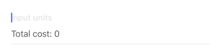
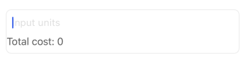
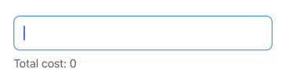
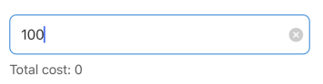

# AdvertiseCalculatorCost

The `AdvertiseCalculatorCost` element is a specialized text input field designed for calculating advertising costs based on a selected placement and a numeric input value (e.g., number of impressions, clicks). It displays the calculated total cost dynamically based on the input and the price associated with the selected placement option.

## Visual Examples

**Variant: standard**

**Variant: outlined**

**Variant: standard-outlined**

**Clear Button Mode: always**

### Props

| Name | Type | Description | Required | Default |
| :--- | :--- | :---------- | :-------- | :------- |
| `autoCapitalize` | `'none'`, `'sentences'`, `'words'`, `'characters'` | Controls automatic capitalization. | | `'sentences'` |
| `autoCorrect` | `boolean` | | | `true` |
| `autoFocus` | `boolean` | | | `false` |
| `clearButtonMode` | `'never'`, `'while-editing'`, `'unless-editing'`, `'always'` | When to show the clear button (iOS only). | | `'never'` |
| `disabled` | `boolean` | | | `false` |
| `editable` | `boolean` | Whether the input is editable. | | `true` |
| `fullWidth` | `boolean` | | | `false` |
| `initialUnit` | `number` | The base unit for the cost calculation (e.g., cost per 1000 impressions means `initialUnit` is 1000). | Yes | |
| `label` | `string` | | | |
| `margin` | `'none'`, `'dense'`, `'normal'`, `'small'` | | | `'normal'` |
| `maxLength` | `number` | | | |
| `minHeight` | `number` | | | |
| `multipleline` | `boolean` | Allows multiple lines of text input. | | `false` |
| `paddingBottom` | `'none'`, `'dense'`, `'normal'`, `'small'` | | | `'normal'` |
| `placeholder` | `string` | | | |
| `placementOptions` | `object` | An object mapping placement keys to their details, including the price per unit (e.g., `{ placement1: { price: 10 }, ... }`). | Yes | |
| `pricePattern` | `object` | An object defining the currency formatting (e.g., `{ thousand_separator: ',', decimal_separator: '.', precision: 2, symbol: '$', ... }`). | Yes | |
| `relatedInitialPrice` | `string` | The name of the form field holding the selected placement/option key. | Yes | |
| `required` | `boolean` | | | `false` |
| `totalNameLabel` | `string` | The translation key for the "Total Cost" label prefix. | | `total_cost` |
| `variant` | `'standard'`, `'outlined'`, `'standard-outlined'` | Specifies the visual style of the component. | | `'standard'` |
