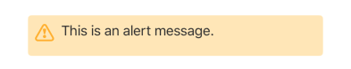
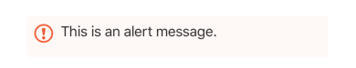

## Alert

Displays a styled alert box containing an HTML message. The appearance (color, icon) depends on the `severity` and `variant`.

## Visual Examples

**Severity: info (default)**

**Severity: success**

**Severity: warning**

**Severity: error**

### Props

| Name | Type | Description | Required | Default |
| :--- | :--- | :---------- | :-------- | :------- |
| `message` | `string` | The HTML content to display in the alert. | Yes | |
| `severity` | `'success' \| 'info' \| 'warning' \| 'error'` | Change icon by the alert type (info, success, warning, error). | | `'info'` |
| `variant` | `'standard'` | Controls the overall style variant of the alert. | | `'standard'` |

