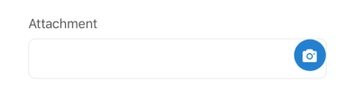

## Attachment

The Attachment element allows users to upload one or more files (photos, videos, or other types) within a form. It provides options for selecting files from the device library or capturing directly from the camera.

## Visual Examples

**Variant: standard-inlined (default)**

**Variant: standard**

**Variant: outlined**

**Variant: filled**

### Props

| Name | Type | Description | Required | Default |
| :--- | :--- | :---------- | :-------- | :------- |
| `cropping` | `boolean` | Enables image cropping after selection (currently applies to photos only). | | `false` |
| `current_files` | `FileItemShape[]` | An array of pre-existing files (used when editing). | | `[]` |
| `description` | `string` | | | |
| `disabled` | `boolean` | | | `false` |
| `file_type` | `'photo' \| 'video' \| 'file'` | Specifies the type of file allowed ('photo', 'video', or generic 'file'). | | `'photo'` |
| `fullWidth` | `boolean` | | | `false` |
| `include_exif` | `boolean` | If `true`, includes EXIF data with uploaded images. | | `false` |
| `isVideoUploadAllowed` | `boolean` | If `true`, allows video file uploads alongside photos. | | `false` |
| `item_type` | `string` | The backend item type associated with the attachment (e.g., 'photo', 'video'). | | `'unknown'` |
| `label` | `string` | | | |
| `margin` | `'none' \| 'dense' \| 'normal'` | | | `'normal'` |
| `max_files` | `number` | Maximum number of files that can be attached. | | `10` |
| `max_upload_filesize` | `object` | An object defining maximum upload size per file type (e.g., `{ photo: 5242880, video: 10485760 }`). | | `{}` |
| `maxFilesDescription` | `string` | Custom description text related to the maximum file limit. | | |
| `min_files` | `number` | Minimum number of files required. | | `1` |
| `multiple` | `boolean` | Allows selecting multiple files if `true`. | | `false` |
| `paddingBottom` | `string` | | | |
| `required` | `boolean` | | | `false` |
| `variant` | `'standard' \| 'outlined' \| 'filled' \| 'standard-inlined'` | The display style variant. | | `'standard-inlined'` |
