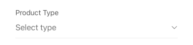
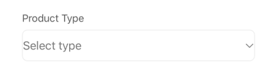
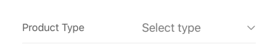
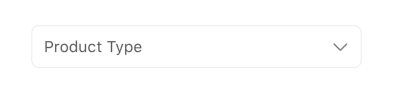

## Autocomplete

A form element allowing users to select one or multiple options from a list, often populated dynamically via an API search. It presents the selected value(s) and opens a dedicated interface for searching and selecting options.

## Visual Examples

**Variant: standard**

**Variant: outlined**

**Variant: standard-inlined**

**Variant: standard-outlined**

### Props

| Name | Type | Description | Required | Default |
| :--- | :--- | :---------- | :-------- | :------- |
| `choice_type` | `string` | Influences how choices are presented or handled internally. | | `undefined` |
| `disable_uncheck` | `boolean` | If `true`, prevents unselecting the currently selected option (single mode). | | `false` |
| `enable_search` | `boolean` | If `true`, enables a search input within the selection interface. | | `true` |
| `fullWidth` | `boolean` | | | `true` |
| `icon` | `string` (IconName) | Name of the icon to display, primarily used in the 'livestream' variant. | | `undefined` |
| `label` | `string` | | Yes | |
| `margin` | `string` ('normal', 'dense', 'none') | | | `'normal'` |
| `multiple` | `boolean` | If `true`, allows the user to select multiple options. | | `false` |
| `paddingBottom` | `string` ('normal', 'dense', 'none') | | | `undefined` |
| `placeholder` | `string` | | | `''` |
| `required` | `boolean` | | | `false` |
| `search_endpoint` | `string` | API endpoint URL used to fetch options dynamically based on user input. | Yes | |
| `search_params` | `object` | Additional parameters to include in the API request to `search_endpoint`. | | `{}` |
| `size` | `string` ('medium', 'small') | The size of the form field. | | `'medium'` |
| `variant` | `'standard'`, `'standard-inlined'`, `'standard-outlined'`, `'outlined'`, `'livestream'` | Specifies the visual style of the component. | | `'outlined'` |
