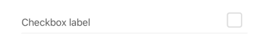
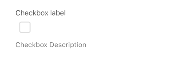
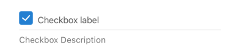

# Checkbox

A form element that renders a checkbox input field. It allows users to toggle between a checked and unchecked state, typically representing a boolean value or a specific selection.

## Visual Examples

**Variant: standard-inlined (Default)**

**Variant: outlined**

**isReverse: true**

### Props

| Name | Type | Description | Required | Default |
| :--- | :--- | :---------- | :-------- | :------- |
| `checkedValue` | `any` | The value submitted when the checkbox is checked. | | `1` |
| `description` | `string` | | | `''` |
| `disabled` | `boolean` | | | `false` |
| `fullWidth` | `boolean` | | | `false` |
| `isReverse` | `boolean` | If true, reverses the order of the label and checkbox control. | | `false` |
| `label` | `string` | | Yes | |
| `margin` | `'none' \| 'dense' \| 'normal'` | | | `'normal'` |
| `paddingBottom` | `'none' \| 'dense' \| 'normal'` | | | `'normal'` |
| `required` | `boolean` | | | `false` |
| `uncheckedValue` | `any` | The value submitted when the checkbox is unchecked. | | `0` |
| `variant` | `'outlined' \| 'standard-inlined'` | Specifies the visual style of the component. | | `'standard-inlined'` |