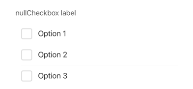
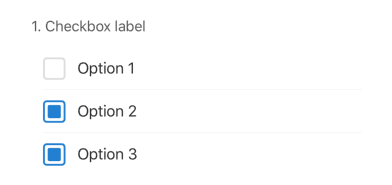

## CheckboxGroup

This element renders a group of checkboxes, allowing users to select multiple options from a predefined list. It integrates with Formik for state management and validation.

## Visual Examples

**Default**

**With Form Order**

### Props

| Name | Type | Description | Required | Default |
| :--- | :--- | :---------- | :-------- | :------- |
| `disabled` | `boolean` | | | `false` |
| `fullWidth` | `boolean` | | | `false` |
| `hasFormOrder` | `boolean` | If `true`, prepends the `order` number to the label. | | `false` |
| `label` | `string` | | Yes | |
| `margin` | `'normal' \| 'dense' \| 'none'` | | | `undefined` |
| `options` | `Array<{ label: string, value: any }>` | An array of objects defining the available checkbox options. | Yes | `[]` |
| `order` | `number` | The numerical order to display before the label (if `hasFormOrder` is true). | | `undefined` |
| `paddingBottom` | `string` | | | `undefined` |
| `required` | `boolean` | | | `false` |
| `variant` | `'standard' \| 'outlined' \| 'filled'` | Specifies the visual style of the component. | | `'standard'` |
