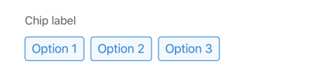

## Chip

Renders a group of selectable chip buttons. Selecting a chip updates the form's `title` and `description` fields with the corresponding values from the selected option.

## Visual Examples

### Props

| Name | Type | Description | Required | Default |
| :--- | :--- | :---------- | :-------- | :------- |
| `label` | `string` | | Yes | |
| `options` | `RadioFieldOptions[]` | An array of option objects to render as chips. Each should have `title` and `description`. | Yes | `[]` |
| `required` | `boolean` | | | `false` |
