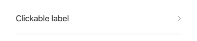
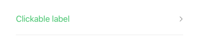

## Clickable

A form element that displays a label and a right arrow, acting as a button. When clicked, it dispatches a specified Redux action with given parameters. It's typically used to navigate to another screen or trigger a modal for further input or selection.

## Visual Examples

**Default**

**Severity: success**

### Props

| Name | Type | Description | Required | Default |
| :--- | :--- | :---------- | :-------- | :------- |
| `action` | `string` | The Redux action type to dispatch on click. | Yes | |
| `fullWidth` | `boolean` | | | `false` |
| `label` | `string` | | Yes | |
| `margin` | `'normal' \| 'dense' \| 'none'` | | | `'normal'` |
| `name` | `string` | The name of the field in the form state. | Yes | |
| `paddingBottom` | `boolean` | | | `false` |
| `params` | `object` | The payload to send with the dispatched action. | Yes | |
| `severity` | `'error' \| 'warning' \| 'info' \| 'success'` | Sets the text color based on severity (e.g., for validation). | | |
| `variant` | `'standard' \| 'outlined' \| 'filled'` | Specifies the visual style of the component. | | `'standard'` |
