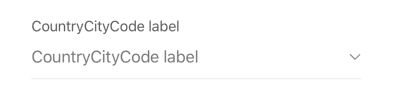

## CountryCityCode

This form element provides an input field that allows users to select a country and associated city/state code. It typically opens a dedicated selection interface (modal or screen) for browsing and choosing the appropriate code.

## Visual Examples

**Variant: standard**

### Props

| Name | Type | Description | Required | Default |
| :--- | :--- | :---------- | :-------- | :------- |
| `backgroundColor` | `string` | Background color for the animated placeholder (used in 'standard-outlined' variant). | | `undefined` |
| `disable_uncheck` | `boolean` | Prevents the user from unselecting the current value if set to true. | | `false` |
| `enable_search` | `boolean` | Enables search functionality within the selection view. | | `false` |
| `fullWidth` | `boolean` | | | `false` |
| `label` | `string` | | Yes | `''` |
| `margin` | `'none' \| 'dense' \| 'normal'` | | | `'normal'` |
| `paddingBottom` | `'none' \| 'dense' \| 'normal'` | | | `'normal'` |
| `required` | `boolean` | | | `false` |
| `search_endpoint` | `string` | API endpoint used for loading options. | Yes | `undefined` |
| `search_params` | `object` | Additional parameters for the search request. Values can be dynamically sourced from the form context. | | `undefined` |
| `variant` | `'standard' \| 'outlined' \| 'filled' \| 'standard-outlined'` | Specifies the visual style of the component. | | `'standard'` |
