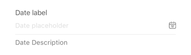
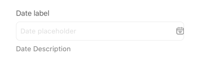
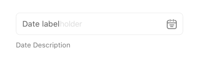
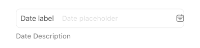

## Date

A form element that allows users to select a date, time, or both using a native modal picker.

## Visual Examples

**Variant: standard**

**Variant: outlined**

**Variant: standard-outlined**

**Variant: outlined (Inlined)**

### Props

| Name | Type | Description | Required | Default |
| :--- | :--- | :---------- | :-------- | :------- |
| `datePickerMode` | `'date' \| 'time' \| 'datetime'` | Determines if the picker selects date, time, or both. | | `'datetime'` |
| `description` | `string` | | | |
| `disabled` | `boolean` | | | `false` |
| `displayFormat` | `string` | The `moment.js` format string used to display the selected date/time. | | `'DD/MM/YYYY - HH:mm'` |
| `endOfDay` | `boolean` | If `true`, sets the selected time to the end of the day (23:59:59). | | `false` |
| `fullWidth` | `boolean` | | | `false` |
| `label` | `string` | | Yes | `'close_time'` |
| `margin` | `'none' \| 'normal' \| 'dense'` | | | `'normal'` |
| `maxDate` | `string` | The maximum selectable date (ISO string or format specified by `momentResultFormat`). | | |
| `minDate` | `string` | The minimum selectable date (ISO string or format specified by `momentResultFormat`). | | |
| `placeholder` | `string` | | | |
| `required` | `boolean` | | | `false` |
| `startOfDay` | `boolean` | If `true`, sets the selected time to the start of the day (00:00:00). | | `false` |
| `time_zone_gmt` | `string` | Timezone identifier (e.g., 'Asia/Ho_Chi_Minh') for display formatting. | | User's timezone |
| `timeFormat` | `12 \| 24` | Specifies 12 or 24-hour time format for the picker. | | `12` |
| `variant` | `'standard' \| 'outlined' \| 'filled'` | Specifies the visual style of the component. | | `'standard'` |
