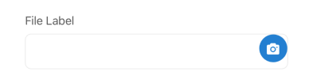

## File

The `File` form element allows users to select and upload a single file, typically an image or video. It provides options to choose from the device library or capture directly using the camera. It handles file preview, upload progress (implicitly via `SinglePhotoItemView`), deletion, and file size validation.
## Visual Examples
 
**Variant: standard**
 

 
**Variant: outlined**
 

 
**Variant: standard-inlined**
 

 
**Variant: outlined-inlined**
 

 
### Props
 

| Name | Type | Description | Required | Default |
| :--- | :--- | :---------- | :-------- | :------- |
| `cropping` | `boolean` | Enable image cropping after selection (currently might have limitations). | | `false` |
| `description` | `string` | | | `''` |
| `extraProps` | `object` | Additional props for styling or behavior. | | `{}` |
| `file_type` | `string` | Type of file allowed ('photo', 'video'). | | `photo` |
| `fullWidth` | `boolean` | | | `false` |
| `include_exif` | `boolean` | Include EXIF data when selecting photos. | | `true` |
| `item_type` | `string` | The type identifier for the uploaded item on the backend. | | `unknown` |
| `label` | `string` | | | `''` |
| `margin` | `string` | | | `normal` |
| `max_upload_filesize` | `object` | Max file sizes in bytes (e.g., `{ photo: 5242880, video: 10485760 }`). `0` means no limit. | | `{ photo: 0, video: 0 }` |
| `paddingBottom` | `string` | | | `normal` |
| `preview_url` | `string` | URL of an existing image/file to preview initially. | | `undefined` |
| `required` | `boolean` | | | `false` |
| `upload_url` | `string` | The API endpoint for direct file uploads. | | `/file` |
| `variant` | `'standard' \| 'outlined' \| 'outlined-inlined' \| 'standard-inlined'` | Specifies the visual style of the component. | | `standard-inlined` |
