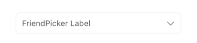

## FriendPicker

A form element that allows users to select one or multiple friends from a list, typically fetched via an API. It presents a user-friendly interface for friend selection within forms.

## Visual Examples

**Variant: standard**

**Variant: outlined**

**Variant: standard-inlined**

**Variant: standard-outlined**

### Props

| Name | Type | Description | Required | Default |
| :--- | :--- | :---------- | :-------- | :------- |
| `api_endpoint` | `string` | API endpoint to fetch friend suggestions. | Yes | `undefined` |
| `choice_type` | `string` | Type of choice mechanism. | | `undefined` |
| `disable_custom` | `boolean` | Disables custom privacy selection. | | `false` |
| `disable_uncheck` | `boolean` | Prevents unselecting if required. | | `false` |
| `disabled` | `boolean` | | | `false` |
| `enable_search` | `boolean` | Enables searching within the friend list. | | `false` |
| `fullWidth` | `boolean` | | | `false` |
| `initialValue` | `OptionsItemShape[]` | Initial selected friend(s). | | `undefined` |
| `label` | `string` | | | `''` |
| `margin` | `'none' \| 'dense' \| 'normal'` | | | `'normal'` |
| `multiple` | `boolean` | Allows selecting multiple friends. | | `false` |
| `options` | `OptionsItemShape[]` | Predefined list of options. | | `[]` |
| `paddingBottom` | `'none' \| 'dense' \| 'normal'` | | | `undefined` |
| `placeholder` | `string` | | | `undefined` |
| `required` | `boolean` | | | `false` |
| `showWithoutOptions` | `boolean` | Whether to show the field without options. | | `undefined` |
| `suboptions` | `SubOptionsShape` | Additional options or configurations. | | `undefined` |
| `value_type` | `string` | Specifies the type of value returned. | | `undefined` |
| `variant` | `'standard' \| 'outlined' \| 'standard-inlined' \| 'standard-outlined'` | Specifies the visual style of the component. | | `'standard'` |
