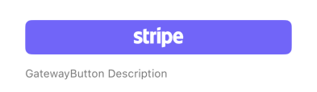

## GatewayButton

Renders a button specific to a payment gateway (e.g., Apple Pay, Stripe). It handles setting the selected gateway ID, passing relevant data, and triggering form submission upon click. It can display platform-specific buttons (Apple Pay/Google Pay) or a generic button based on the `variant` prop.
## Visual Examples

**Variant: activitypoint**

**Variant: applepay**

**Variant: googlepay**

**Variant: paypal**

**Variant: stripe**

### Props

| Name | Type | Description | Required | Default |
| :--- | :--- | :---------- | :-------- | :------- |
| `confirmation` | `{ title: string, message: string }` | Optional configuration for a confirmation dialog shown before submission (used for `activitypoint` variant). | | |
| `description` | `string` | | | `''` |
| `disabled` | `boolean` | | | `false` |
| `fullWidth` | `boolean` | | | `true` |
| `gateway_config` | `any` | Configuration specific to the selected payment gateway, passed to the form on submission. | Yes | |
| `gateway_id` | `string \| number` | The unique identifier for the payment gateway this button represents. | Yes | |
| `icon` | `string` | Optional icon name (from the icon set) to display on the generic button. | | |
| `item` | `any` | Item data associated with the payment, passed to the form on submission. | Yes | |
| `label` | `string` | | Yes | |
| `margin` | `'none' \| 'dense' \| 'normal' \| 'small'` | | | `'none'` |
| `size` | `'small' \| 'medium' \| 'large'` | Size applied to the underlying form control (affects spacing/layout). | | |
| `variant` | `'applepay' \| 'googlepay' \| 'stripe' \| 'paypal' \| 'activitypoint'` | The type of gateway. Determines rendering logic, platform availability (Apple/Google Pay), and behavior. | Yes | |
