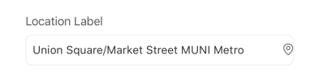
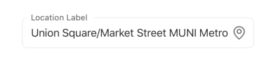
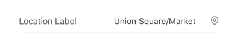

# Location

A form field that allows users to select a geographical location using a native location picker interface. Clicking the field opens the picker, and the selected location's address is displayed.

## Visual Examples

**Variant: standard**

**Variant: outlined**

**Variant: standard-outlined**

**Variant: standard-inlined**

## Props

| Name | Type | Description | Required | Default |
| :--- | :--- | :---------- | :-------- | :------- |
| `label` | `string` | The label displayed for the form field. | Yes | |
| `placeholder` | `string` | Placeholder text shown when no location is selected (not shown for 'standard-outlined' variant). | | `''` |
| `variant` | `'standard' \| 'outlined' \| 'filled' \| 'standard-outlined' \| 'livestream'` | Controls the visual style of the component. | | `'standard'` |
| `fullWidth` | `boolean` | If `true`, the component takes the full width of its container. | | `false` |
| `margin` | `'none' \| 'dense' \| 'normal'` | Controls the margin around the component. | | `'normal'` |
| `paddingBottom` | `'none' \| 'dense' \| 'normal'` | Controls the bottom padding of the component. | | `'normal'` |
| `required` | `boolean` | Marks the field as required in the form validation. | | `false` |
| `disabled` | `boolean` | If `true`, the input field is disabled. | | `false` |
| `types` | `PlaceType[]` | Filters the types of places returned by the location picker (e.g., 'address', 'geocode', 'establishment'). | | |
| `inline` | `boolean` | Controls if the label is displayed inline with the input. | | `false` |