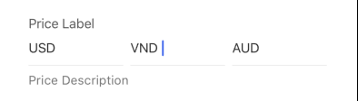
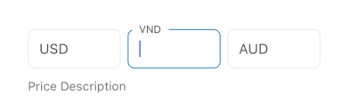

## Price

Renders a set of price input fields, often used for different currencies or price types. The actual input fields are defined by the `options` prop. This component conditionally renders different implementations based on the API version, but this documentation focuses on the behavior for API version 5.1.8 and later.

## Visual Examples

**Variant: standard**

**Variant: standard-outlined**

### Props

| Name | Type | Description | Required | Default |
| :--- | :--- | :---------- | :-------- | :------- |
| `description` | `string` | | | |
| `disabled` | `boolean` | | | `false` |
| `findReplace` | `{ find: string \| RegExp, replace: string }` | Defines rules for replacing characters in the input value. | | |
| `fullWidth` | `boolean` | | | `false` |
| `label` | `string` | | Yes | |
| `margin` | `'normal' \| 'dense' \| 'none'` | | | |
| `maxLength` | `number` | | | |
| `options` | `Array<{ key: string, name: string, required?: boolean, requiredWhen?: object, ... }>` | Defines the individual price inputs (e.g., currencies). Each object requires `key` (label/value key) and `name`. Can include `required`. | Yes | `[]` |
| `paddingBottom` | `string \| number` | | | |
| `required` | `boolean` | | | `false` |
| `variant` | `'standard' \| 'standard-outlined'` | Specifies the visual style of the component. | | `'standard'` |
