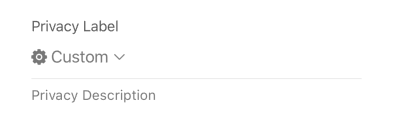
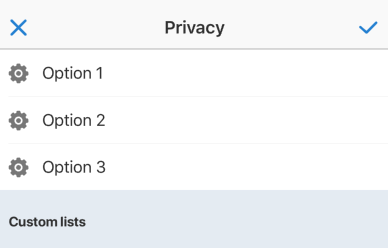
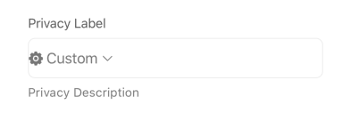
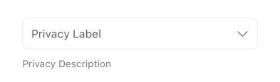
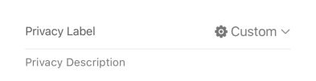

## Privacy

This element provides a user interface for selecting privacy settings, typically used for controlling who can see a piece of content (e.g., a post). It displays the currently selected privacy option (with an icon and label) and opens a dedicated selector view (`SelectPrivacyView`) when tapped.

## Visual Examples

**Variant: standard**

**Variant: outlined**

**Variant: standard-outlined**

**Variant: standard-inlined**

### Props

| Name | Type | Description | Required | Default |
| :--- | :--- | :---------- | :-------- | :------- |
| `description` | `string` | | | `undefined` |
| `disable_custom` | `boolean` | If `true`, prevents users from selecting custom privacy options. | | `false` |
| `disabled` | `boolean` | | | `false` |
| `fullWidth` | `boolean` | | | `false` |
| `label` | `string` | | Yes | |
| `margin` | `'dense' \| 'normal' \| 'none'` | | | `'normal'` |
| `multiple` | `boolean` | If `true`, allows selecting multiple privacy options (currently single). | | `false` |
| `name` | `string` | The unique identifier for the field within the form. | Yes | |
| `options` | `Array<{ label: string, value: string }>` | An array of predefined privacy options available for selection. | Yes | `[]` |
| `paddingBottom` | `'dense' \| 'normal' \| 'none'` | | | `undefined` |
| `required` | `boolean` | | | `false` |
| `suboptions` | `SubOptionsShape` | Additional options, often used for custom privacy lists or friend lists. | | `[]` |
| `variant` | `'standard' \| 'outlined' \| 'standard-outlined' \| 'standard-inlined'` | Specifies the visual style of the component. | | `'standard-inlined'` |
