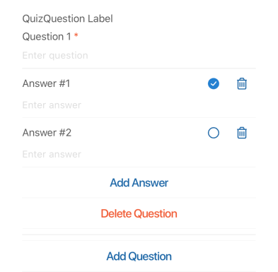

## QuizQuestion

A form element for creating and managing a list of quiz questions, each with multiple answers and a designated correct answer. Users can add/remove questions and answers within specified limits.

## Visual Examples

**Default View**

### Props

| Name | Type | Description | Required | Default |
| :--- | :--- | :---------- | :-------- | :------- |
| `defaultAnswers` | `number` | The default number of answer fields to show when adding a new question. | | `2` |
| `disabled` | `boolean` | | | `false` |
| `fullWidth` | `boolean` | | | `true` |
| `label` | `string` | | Yes | |
| `margin` | `'normal'`, `'dense'`, `'none'` | | | `'normal'` |
| `maxAnswerLength` | `number` | The maximum character length allowed for each answer text. | | `undefined` |
| `maxAnswers` | `number` | The maximum number of answers allowed per question. | | `20` |
| `maxLength` | `number` | | | `undefined` |
| `maxQuestions` | `number` | The maximum number of questions allowed. | | `10` |
| `minAnswers` | `number` | The minimum number of answers required per question. | | `2` |
| `minQuestions` | `number` | The minimum number of questions required. | | `1` |
| `paddingBottom` | `'normal'`, `'dense'`, `'none'` | | | `'normal'` |
| `required` | `boolean` | | | `false` |
