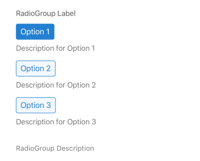

## RadioGroup

A form element that displays a group of radio buttons, allowing the user to select a single option.
## Visual Examples

**Default**

### Props

| Name | Type | Description | Required | Default |
| :--- | :--- | :---------- | :-------- | :------- |
| `description` | `string` | | | `''` |
| `initialValue` | `string` | The initial value/selection for the radio group. | | `''` |
| `label` | `string` | | Yes | |
| `options` | `Array<{label: string, value: any, description?: string}>` | An array of objects defining each radio button. Each object needs `label` and `value`. `description` is optional. | Yes | `[]` |
| `order` | `number` | Optional number to prefix the label for ordering. | | |
| `required` | `boolean` | | | `false` |
