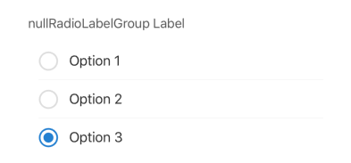
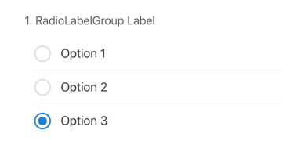

## RadioLabelGroup

Renders a group of radio buttons, visually styled using circular icons, allowing the user to select only one option from a list. This element is typically used for membership questions or similar single-choice scenarios within a form.

## Visual Examples
 
**Default**
 

 
**hasFormOrder: true, order: 1**
 

 
### Props

| Name | Type | Description | Required | Default |
| :--- | :--- | :---------- | :-------- | :------- |
| `disabled` | `boolean` | | | `false` |
| `fullWidth` | `boolean` | | | `false` |
| `hasFormOrder` | `boolean` | If `true`, prepends the `order` number to the `label`. | | `false` |
| `label` | `string` | | Yes | |
| `margin` | `'normal' \| 'dense' \| 'none' \| string` | | | `'normal'` |
| `options` | `Array<{ value: string, label?: string, disable?: boolean }>` | An array of objects defining each radio option. `value` is required, `label` and `disable` are optional. | Yes | `[]` |
| `order` | `number` | The numerical order to display before the label when `hasFormOrder` is `true`. | | |
| `paddingBottom` | `string` | | | |
| `required` | `boolean` | | | `false` |
