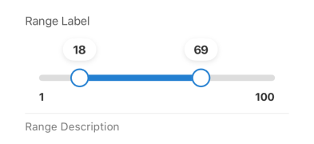

## Range

A form element that renders a dual-handle slider, allowing users to select a range of values. It uses two separate field names (defined in `min.name` and `max.name` props) to store the selected minimum and maximum values in the form state.

## Visual Examples
 
**Default**
 

 
### Props

| Name | Type | Description | Required | Default |
| :--- | :--- | :---------- | :-------- | :------- |
| `description` | `string` | | | |
| `fullWidth` | `boolean` | | | `false` |
| `label` | `string` | | | |
| `margin` | `'none' \| 'dense' \| 'normal'` | | | `'normal'` |
| `max` | `object { label: string, name: string, value: number }` | Config for the maximum value handle. `name` is the formik field name, `value` is the slider maximum limit. | Yes | |
| `min` | `object { label: string, name: string, value: number }` | Config for the minimum value handle. `name` is the formik field name, `value` is the slider minimum limit. | Yes | |
| `paddingBottom` | `'none' \| 'dense' \| 'normal'` | | | |
| `required` | `boolean` | | | `false` |
| `step` | `number` | The granularity that the slider can step through values. | Yes | |
