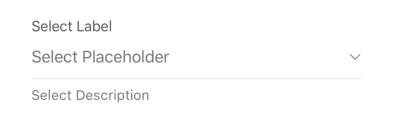
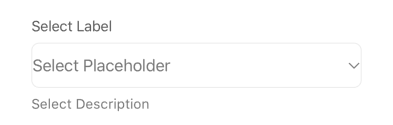
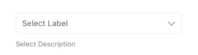
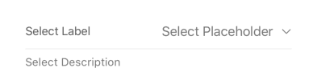

## Select

The `Select` form element provides a dropdown or list interface for users to choose one or multiple options from a predefined set. It supports various configurations like search, multiple selections, and different visual styles.

## Visual Examples

**Variant: standard**

**Variant: outlined**

**Variant: standard-outlined**

**Variant: standard-inlined**

### Props

| Name | Type | Description | Required | Default |
| :--- | :--- | :---------- | :-------- | :------- |
| `choice_type` | `string` | Specifies the type of choice control (e.g., 'radio', 'checkbox'). | | `undefined` |
| `description` | `string` | | | `undefined` |
| `disableClearable` | `boolean` | If `true`, prevents the user from clearing the selected value. | | `false` |
| `disable_custom` | `boolean` | If `true`, disables the ability to add custom options (if applicable). | | `false` |
| `disabled` | `boolean` | | | `false` |
| `enable_search` | `boolean` | If `true`, enables a search input within the options list. | | `false` |
| `fullWidth` | `boolean` | | | `false` |
| `label` | `string` | | Yes | |
| `margin` | `'none' \| 'dense' \| 'normal'` | | | `'normal'` |
| `multiple` | `boolean` | If `true`, allows selecting multiple options. | | `false` |
| `options` | `OptionsItemShape[]` | An array of available options for the select field. | Yes | `[]` |
| `paddingBottom` | `'none' \| 'dense' \| 'normal'` | | | `'normal'` |
| `placeholder` | `string` | | | `'select'` |
| `required` | `boolean` | | | `false` |
| `resetValue` | `boolean` | If `true`, indicates the value should be reset under certain conditions. | | `false` |
| `showWithoutOptions` | `boolean` | If `true`, renders the field even if the `options` array is empty. | | `false` |
| `suboptions` | `SubOptionsShape` | Additional options grouped under main options (e.g., for dependent selects). | | `undefined` |
| `useSectionList` | `boolean` | If `true`, uses a SectionList to display options (requires specific data structure). | | `false` |
| `value_type` | `string` | Specifies the type of value to store (e.g., 'array'). | | `undefined` |
| `variant` | `'standard' \| 'outlined' \| 'standard-outlined' \| 'standard-inlined'` | Specifies the visual style of the component. | | `'standard'` |
