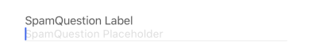
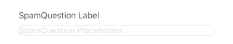
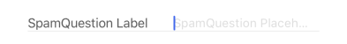

## SpamQuestion

This element renders a text input field, often accompanied by an image, designed to present a question to the user to prevent spam submissions.

## Visual Examples

**Variant: standard**

**Variant: outlined**

**Variant: standard-inlined**

### Props

| Name | Type | Description | Required | Default |
| :--- | :--- | :---------- | :-------- | :------- |
| `clearButtonMode` | `'never' \| 'while-editing' \| 'unless-editing' \| 'always'` | Controls when the clear text button appears in the input field (iOS only). | | `undefined` |
| `disabled` | `boolean` | | | `false` |
| `editable` | `boolean` | Determines if the text input field can be edited by the user. | | `true` |
| `fullWidth` | `boolean` | | | `false` |
| `imageUri` | `string` | The URI for the image associated with the spam question. | Yes | |
| `label` | `string` | | | |
| `margin` | `'none' \| 'dense' \| 'normal'` | | | `undefined` |
| `paddingBottom` | `'none' \| 'dense' \| 'normal'` | | | `undefined` |
| `placeholder` | `string` | | | |
| `required` | `boolean` | | | `false` |
| `variant` | `'standard' \| 'outlined' \| 'standard-inlined'` | Specifies the visual style of the component. | | `'standard-inlined'` |
