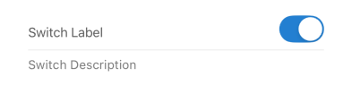

# Switch

A form element that renders a toggle switch input, allowing users to select between two states (on/off).

## Visual Examples

**Default State**

### Props

| Name | Type | Description | Required | Default |
| :--- | :--- | :---------- | :-------- | :------- |
| `checkedValue` | `any` | The value submitted when the switch is turned on. | | `1` |
| `description` | `string` | | | `''` |
| `disabled` | `boolean` | | | `false` |
| `fullWidth` | `boolean` | | | `false` |
| `label` | `string` | | Yes | `undefined` |
| `margin` | `'none'\|'normal'\|'dense'` | | | `'normal'` |
| `required` | `boolean` | | | `false` |
| `uncheckedValue` | `any` | The value submitted when the switch is turned off. | | `0` |