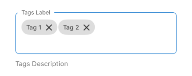

## Tags

A form element that allows users to input and manage a list of tags. Users can type tags and press Enter/Done to add them. Existing tags can be removed by clicking the close icon on the tag.

### Visual Examples

**Variant: standard**

**Variant: outlined**

**Variant: outlined-inlined**

**Variant: standard-outlined**

**Variant: standard-inlined**

### Props

| Name | Type | Description | Required | Default |
| :--- | :--- | :---------- | :-------- | :------- |
| `clearButtonMode` | `string` | Determines the visibility of the clear button (standard TextInput prop). | | |
| `description` | `string` | | | |
| `editable` | `boolean` | If false, the input cannot be edited (standard TextInput prop). | | `true` |
| `fullWidth` | `boolean` | | | `false` |
| `label` | `string` | | | |
| `margin` | `'normal' \| 'dense' \| 'none'` | | | |
| `paddingBottom` | `'normal' \| 'dense' \| 'none'` | | | `'normal'` |
| `placeholder` | `string` | | | `'enter text'` |
| `required` | `boolean` | | | `false` |
| `variant` | `'standard' \| 'outlined' \| 'outlined-inlined' \| 'standard-outlined' \| 'standard-inlined'` | Specifies the visual style of the component. | | `'standard'` |
