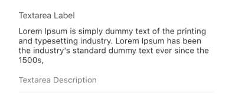
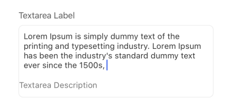
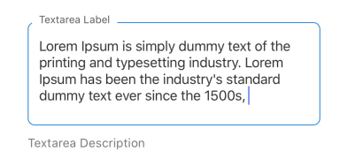

## Textarea

Provides a multi-line text input field for forms.

## Visual Examples

**Variant: standard**

**Variant: outlined**

**Variant: standard-outlined**

### Props

| Name | Type | Description | Required | Default |
| :--- | :--- | :---------- | :-------- | :------- |
| `autoCapitalize` | `'none' \| 'sentences' \| 'words' \| 'characters'` | Controls the automatic capitalization behavior of the text input. | | `'none'` |
| `autoCorrect` | `boolean` | Enables or disables autocorrection for the input. | | Platform default |
| `autoFocus` | `boolean` | | | `false` |
| `clearButtonMode` | `'never' \| 'while-editing' \| 'unless-editing' \| 'always'` | (iOS only) Determines when the standard clear text button appears inside the text input. | | `'never'` |
| `contextualDescription` | `string` | Additional description text that might be combined with dynamic content based on the input value. | | |
| `description` | `string` | | | |
| `disabled` | `boolean` | | | `false` |
| `editable` | `boolean` | If false, the text content cannot be modified by the user. | | `true` |
| `findReplace` | `{ find: string, replace: string }` | Defines patterns for find-and-replace operations on the input value, often used for generating derived text. | | |
| `fullWidth` | `boolean` | | | `false` |
| `label` | `string` | | | |
| `margin` | `'none' \| 'normal' \| 'dense'` | | | `'normal'` |
| `maxLength` | `number` | | | |
| `minHeight` | `number` | | | |
| `name` | `string` | The name of the field used in the form state. | Yes | |
| `placeholder` | `string` | | | |
| `required` | `boolean` | | | `false` |
| `variant` | `'standard' \| 'outlined' \| 'standard-outlined'` | Specifies the visual style of the component. | | `'standard'` |
